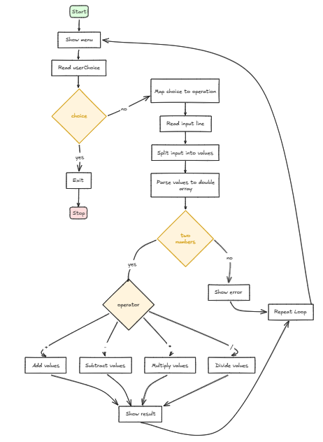

 # C.A.L.C. ? Console Arithmetic & List Calculator

 

 ## Beskrivelse

 Et enkelt konsollbasert kalkulatorprogram skrevet i C#. Programmet lar brukeren velge en operasjon (addisjon, subtraksjon, multiplikasjon, divisjon), taste inn flere tall i én linje, og deretter beregner resultatet ved å kalle riktig overload av regnefunksjonene.

 Grensesnittet er på norsk og programmet aksepterer desimaler (bruk `.` eller `,` som desimalskilletegn ? den blir normalisert ved parsing).

 ## Funksjoner

- Velg operasjon: addisjon, subtraksjon, multiplikasjon eller divisjon
- Skriv inn flere tall i én linje (skilt med mellomrom)
- Parser både heltall og desimaltall (`double`)
- Automatisk valg av riktig overload basert på input (brukes `double[]` for desimaler)
- Håndterer deling på null ved å gi en feilmelding

## Hvordan bruke

1. Bygg prosjektet:
```bash
dotnet build
```

2. Kjør programmet:
```bash
dotnet run
```

3. Følg menyen i konsollen:
- Velg operasjon (1-4)
- Skriv inn tall separert med mellomrom og trykk Enter
- Programmet viser resultatet eller en passende feilmelding

## Programlogikk (kort)

- `Main()`: skriver velkommen og kjører en løkke mens `activeMenu` er `true`.
- `initMenu()`: skriver ut menyvalg.
- `HandleMenu()`: leser brukerens valg og mapper det til et operasjonstegn (`+`, `-`, `*`, `/`) eller avslutter med `Exit()`.
- `AskForNumbersAndCompute(operation)`: leser en linje med tall, splitter på mellomrom, parser til `double[]`, og sjekker at det er minst to tall.
- `Calculate(operation, values)`: ruter til riktig overload:
	- `Add(double[] values)`
	- `Subtract(double[] values)`
	- `Multiply(double[] values)`
	- `Divide(double[] values)`
- Overloadene utfører beregningen over alle elementene i arrayen og returnerer resultatet.

## Feilhåndtering

- Dersom input ikke kan parses til tall vises en feilmelding.
- Dersom det er færre enn to tall vises en feilmelding.
- Ved forsøk på deling på null vises en feilmelding.

## Språk

Programmet bruker norsk for alle brukerrettede meldinger.